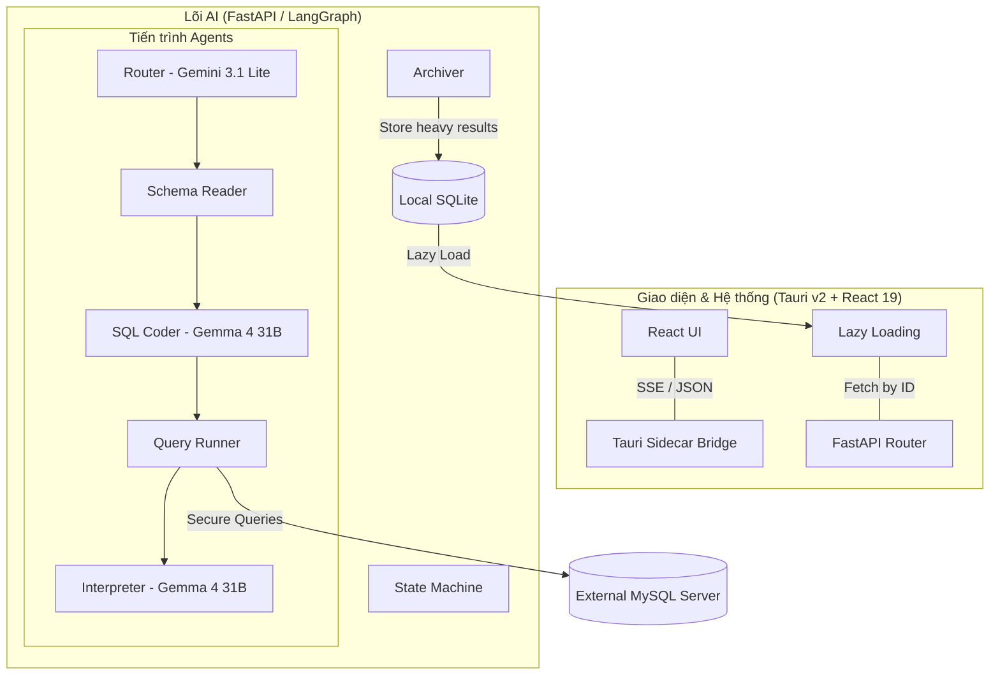

<div align="center">
  
  <h1>🚀 SQL Copilot Pro AI</h1>
  <p><strong>Hệ Điều Hành Dữ Liệu Thông Minh - Database IDE Thế Hệ Mới</strong></p>
  
  <p align="center">
    <a href="https://sql-copilot-desktop-app-ai-agent-we.vercel.app/">
      
    </a>
    <a href="https://github.com/iloveflo/SQLCopilot_DesktopApp_AI_agent/releases/latest">
      
    </a>
  </p>

  <p>
    
    
    
    
    
  </p>
</div>

---

## 📖 Mục Lục
1. [Tầm Nhìn Dự Án](#-tầm-nhìn-dự-án)
2. [Chi Tiết Tính Năng Đột Phá](#-chi-tiết-tính-năng-đột-phá)
3. [Kiến Trúc LangGraph Brain (Deep Dive)](#-kiến-trúc-langgraph-brain-deep-dive)
4. [Lớp Bảo Mật Phòng Thủ Dữ Liệu](#-lớp-bảo-mật-phòng-thủ-dữ-liệu)
5. [Hiệu Năng & Tiered Storage Architecture](#-hiệu-năng--tiered-storage-architecture)
6. [Quản Trị Admin Panel (HITL Workflow)](#-quản-trị-admin-panel-hitl-workflow)
7. [Công Nghệ Lõi (Tech Stack)](#-công-nghệ-lõi-tech-stack)
8. [Hướng Dẫn Triển Khai & Đóng Gói](#-hướng-dẫn-triển-khai--đóng-gói)
9. [Lộ Trình Phát Triển (Roadmap)](#-lộ-trình-phát-triển-roadmap)

---

## 🌟 Tầm Nhìn Dự Án

**SQL Copilot Pro AI** không chỉ là một công cụ sinh SQL. Nó là một **AI-Native Database IDE** chuyên dụng cho kỷ nguyên GenAI. 

Sứ mệnh của chúng tôi là xóa bỏ rào cản giữa con người và dữ liệu thô. Bằng cách kết hợp sức mạnh lập luận của các Mô hình Ngôn ngữ Lớn (LLM) với cấu trúc kiểm soát nghiêm ngặt của **Multi-Agent State Machines**, ứng dụng biến những dòng lệnh SQL khô khan thành những câu chuyện dữ liệu có nghĩa, có biểu đồ và có chiều sâu insights.

---

## ✨ Chi Tiết Tính Năng Đột Phá

### 1. Adaptive AI Interpreter (Phản hồi Thông minh Thích ứng)
Hệ thống AI tự động điều chỉnh hành vi dựa trên kết quả truy vấn:
- **Chế độ Flash (Listing):** Nếu bạn yêu cầu liệt kê, AI sẽ tóm tắt 1 dòng ngắn gọn vì giao diện đã hiển thị bảng dữ liệu chuyên biệt.
- **Chế độ Analytic (Insights):** Khi không có biểu đồ, AI sẽ phân tích sâu: Tóm tắt -> Điểm nhấn số liệu -> Đề xuất hành động.
- **Chế độ Visualist (Biểu đồ):** Ưu tiên giải thích các xu hướng trên biểu đồ Plotly thay vì lặp lại số liệu thô.

### 2. Multi-Database Unified Workspace
Làm việc đồng thời với nhiều Database trong cùng một Host:
- Hỗ trợ cú pháp nối bảng chéo Database (`database`.`table`).
- Tự động nhận diện Schema của tất cả Database được chọn để xây dựng ngữ cảnh AI chính xác nhất.
- Chuyển đổi Database linh hoạt bằng một cú click chuột mà không cần cấu hình lại kết nối.

### 3. Glassmorphism UI & Professional Dashboard
Giao diện được thiết kế với tiêu chuẩn thẩm mỹ cực cao:
- **Hiệu ứng Glassmorphism:** Mang lại cảm giác hiện đại, sang trọng trên Windows và macOS.
- **Pinning System:** Ghim các biểu đồ quan trọng lên Dashboard để theo dõi các chỉ số thời gian thực.
- **Responsive Thread:** Luồng hội thoại hỗ trợ thu phóng, lọc tìm kiếm nội dung thông minh.

---

## 🧠 Kiến Trúc LangGraph Brain (Deep Dive)

Hệ thống sử dụng một **State Machine (Máy trạng thái)** phức tạp được điều phối bởi LangGraph để đảm bảo AI không bị "ảo giác" (hallucination):



### Các Agent Nodes chuyên biệt:
1.  **Router (Gemini 3.1 Flash Lite):** Người điều hướng siêu tốc, quyết định yêu cầu nào cần dùng AI, yêu cầu nào dùng Cache.
2.  **SQL Coder (Gemma 4 31B IT):** "Kiến trúc sư" viết mã SQL chính xác, đồng thời áp dụng các bộ lọc bảo mật dữ liệu.
3.  **Archiver:** Node chuyên biệt thực hiện việc "đóng chai" dữ liệu thô vào SQLite để giữ cho bộ não AI luôn nhẹ nhàng.

---

## 🛡️ Lớp Bảo Mật Phòng Thủ Dữ Liệu

Dự án đặt bảo mật lên hàng đầu với 3 lớp phòng thủ chủ động:

### Lớp 1: Implicit PII Filtering (Lọc dữ liệu nhạy cảm)
SQL Generator được tiêm các "Mệnh lệnh tối thượng". Ngay cả khi người dùng yêu cầu `SELECT * FROM users`, AI sẽ tự động liệt kê các cột **An toàn**, tuyệt đối loại bỏ các cột nhạy cảm như `password`, `token`, `secret`, `ssn`...

### Lớp 2: Credential Scrubbing (Xóa sạch dấu vết)
Toàn bộ thông tin đăng nhập Database được xóa sạch khỏi bộ nhớ RAM của hệ thống ngay khi người dùng nhấn "Ngắt kết nối".

### Lớp 3: HITL (Human-in-the-Loop)
Các truy vấn quản trị (tạo user, phân quyền...) **BẮT BUỘC** phải qua vòng phê duyệt thủ công của Admin sau khi AI lập kế hoạch SQL.

---

## ⚡ Hiệu Năng & Tiered Storage Architecture

Để duy trì tốc độ phản hồi < 3 giây ngay cả khi hội thoại dài, ứng dụng áp dụng kiến trúc **Lưu trữ phân tầng**:

1.  **L1 - Active Memory:** Chỉ lưu văn bản thuần và Metadata gọn nhẹ trong State của LangGraph.
2.  **L2 - Side-channel Storage:** Lưu trữ hàng MB dữ liệu bảng và biểu đồ vào SQLite nội bộ (bảng `chat_message_results`).
3.  **Lazy Loading:** React UI chỉ tải dữ liệu thô khi người dùng thực sự cuộn màn hình tới vị trí tin nhắn đó.

---

## 🛠️ Công Nghệ Sử Dụng (Tech Stack)
## 🛠️ Công Nghệ Lõi (Tech Stack)

### **Giao diện người dùng (Frontend)**
- **React 19 & TypeScript:** Framework UI hiện đại nhất.
- **Tauri 2.0 (Rust):** Shell Desktop an toàn, nhẹ và tích hợp sâu hệ thống.
- **Plotly.js:** Trực quan hóa dữ liệu cấp chuyên gia.

---

## 🧠 AI Model Orchestration & LLM Strategy

Trái tim của **SQL Copilot Pro AI** là một chiến lược điều phối mô hình kép (Dual-Model Strategy) tinh vi, được thiết kế để cân bằng giữa **độ trễ siêu thấp** và **khả năng lập luận logic cực cao**.

### 1. Chiến lược Mô hình kép (Dual-Model Strategy)
Hệ thống không sử dụng một mô hình duy nhất cho mọi tác vụ, mà phân phối khối lượng công việc dựa trên đặc thù của từng Agent:

- **The Brain (Gemma 4 31B IT):** Đóng vai trò chủ chốt trong các tác vụ `Planner`, `SQL Coder`, `Interpreter`. 
    - *Tại sao?* Gemma 4 có khả năng "Reasoning" vượt trội, tuân thủ nghiêm ngặt các chỉ thị lập trình phức tạp và ít bị ảo giác khi xử lý các Schema CSDL thực tế.
- **The Router (Gemini 3.1 Flash Lite):** Được sử dụng cho Node `Router` để điều hướng yêu cầu.
    - *Tại sao?* Router cần tốc độ phản hồi tính bằng milia giây để quyết định luồng xử lý (Cache vs AI). Gemini 3.1 Flash Lite là mô hình tối ưu nhất thế giới hiện nay cho việc này.

### 2. Ma trận cấu hình Tham số (The Task-Parameter Matrix)
Hệ thống tự động thay đổi cấu hình LLM theo thời gian thực để phù hợp với từng giai đoạn suy nghĩ:

| Tác vụ (Task) | Mô hình sử dụng | Temperature | Max Tokens | Mục tiêu kỹ thuật |
| :--- | :--- | :--- | :--- | :--- |
| **Planner** | Gemma 4 31B | 0.0 | 1024 | Lập kế hoạch JOIN chính xác |
| **SQL Coder** | Gemma 4 31B | 0.0 | 2048 | Viết SQL chuẩn, an toàn |
| **Interpreter** | Gemma 4 31B | 0.3 | 2048 | Nhận xét dữ liệu có chiều sâu |
| **Router** | Gemini 3.1 Lite | 0.0 | 100 | Điều hướng luồng siêu tốc |

### 3. Safety Filter Override (Vượt rào bộ lọc an toàn)
Khác với các ứng dụng Chat thông thường, dự án này ghi đè bộ lọc an toàn (`safety_settings=None`) của Google:
- **Lý do:** Các bộ lọc mặc định thường đánh dấu nhầm các từ khóa SQL mạnh (`DROP`, `DELETE`) hoặc tên bảng nhạy cảm là nội dung nguy hiểm. 
- **Giải pháp:** Chúng tôi thay thế bằng bộ kiểm soát **Agent-based Guardrails** tự viết, giúp AI phân biệt được lệnh quản trị hợp lệ và mã độc hại.

### 4. Tối ưu hóa Cửa sổ Ngữ cảnh (Context Window)
Tận dụng khả năng xử lý **2 triệu tokens** của dòng Gemini để nạp toàn bộ tri thức Database (Schemas, Sample Data) vào mỗi phiên làm việc, giúp AI có cái nhìn toàn cảnh như một DBA thực thụ.

---

## 📦 Hướng Dẫn Triển Khai & Đóng Gói

### 1. Môi trường phát triển (Dev Mode)
Yêu cầu Python 3.12, Node 20+, Rust 1.79+.
```bash
# Backend
cd backend && pip install -r requirements.txt
python -m uvicorn app.main:app --reload --port 8000

# Frontend
cd frontend && npm install
npm run tauri dev
```

### 2. Đóng gói Sidecar Binary
Để ứng dụng chạy mà không cần cài Python trên máy khách, chúng tôi sử dụng kỹ thuật Sidecar:
```bash
cd backend
python package_backend.py
```
Script này sẽ tự động nhận diện **Target Triple** của hệ thống và đóng gói Backend thành tệp nhị phân đơn nhất.

---

## 🚀 Quy Trình CI/CD & Automated Release Pipeline

Dự án áp dụng một hạ tầng CI/CD chuyên nghiệp dựa trên **GitHub Actions**, cho phép tự động hóa 100% quy trình từ đóng gói đến phát hành.

### 1. Tag-Driven Automation
Quy trình Release được kích hoạt tự động mỗi khi một nhà phát triển gắn Tag phiên bản (ví dụ: `v1.2.0`):
- **Trigger:** `push: tags: ['v*']`
- **Changelog Detection:** Tự động phát hiện các thay đổi trong thư mục `backend/` hoặc `frontend/` so với phiên bản trước để quyết định việc build.

### 2. Chiến lược Build Matrix (Đa nền tảng)
Hệ thống khởi chạy song song 3 môi trường Build độc lập để tạo ra các bộ cài đặc thù:
- **Windows (windows-latest):** Sử dụng MSVC biên dịch nhân Rust và tạo bộ cài `.exe` / `.msi`.
- **macOS (macos-latest):** Xây dựng ứng dụng cho cả kiến trúc Intel và Apple Silicon (`.dmg`).
- **Linux (ubuntu-22.04):** Biên dịch môi trường GTK/Webkit, tạo gói `.deb` và `.AppImage`.

### 3. Kỹ thuật "Sidecar Binary" & Target Triples
Đây là trái tim của cơ chế phân phối ứng dụng:
- **Cross-Platform Sidecars:** Backend Python được PyInstaller đóng gói thành các tệp nhị phân native cho từng OS.
- **Naming Convention:** Tên file được đặt theo định dạng `<name>-<target-triple>` (ví dụ: `sql-copilot-backend-x86_64-pc-windows-msvc.exe`) để Tauri có thể nhận diện và điều khiển chính xác.
- **Embedded Engine:** Sidecar này được nhúng thẳng vào gói cài đặt, giúp App hoạt động độc lập hoàn toàn.

### 4. Tự động hóa Versioning Sync
Trước khi biên dịch, CI/CD thực hiện bước đồng bộ hóa phiên bản:
- Trích xuất số phiên bản từ Git Tag (v1.2.3 -> 1.2.3).
- Tự động ghi đè thuộc tính `version` trong `tauri.conf.json` và `Cargo.toml`.
- Đảm bảo tính nhất quán tuyệt đối giữa mã nguồn và thông tin hiển thị trên ứng dụng.

### 5. GitHub Release Integration
Sau khi hoàn tất, công cụ `tauri-action` sẽ tự động:
- Tạo bản Release mới trên GitHub.
- Upload toàn bộ Artifacts lên Cloud.
- Gửi thông báo hoàn tất quá trình đóng gói.

---

## 🗺️ Lộ Trình Phát Triển (Roadmap)
- [ ] Hỗ trợ Multi-Cloud (AWS RDS, Google Cloud SQL).
- [ ] Tích hợp tính năng Dự báo Dữ liệu (Predictive Analysis) bằng Machine Learning.
- [ ] Chế độ "Offline AI" sử dụng Llama 3 qua Ollama.
- [ ] Dashboard theo dõi hiệu năng truy vấn chậm (Slow Query Log Parser).

---
> *SQL Copilot Pro AI - Trí tuệ hóa dữ liệu, giải phóng tiềm năng doanh nghiệp.*
