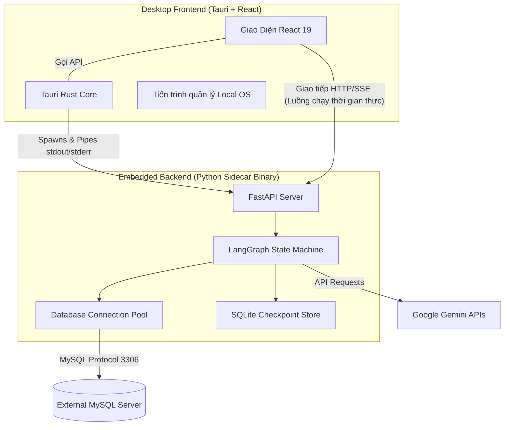

<div align="center">
  <h1>🚀 SQL Copilot Pro AI</h1>
  <p><strong>Công cụ trợ lý Cơ sở dữ liệu ứng dụng Trí Tuệ Nhân Tạo Cao Cấp (GenAI)</strong></p>
  <h3>🌐 <a href="https://sql-copilot-desktop-app-ai-agent-we.vercel.app/" target="_blank">Website Chính Thức & Tải Về Trải Nghiệm</a></h3>
  <br/>
  <p>
    
    
    
    
    
  </p>
</div>

---

## 🌟 Tầm Nhìn Dự Án

**SQL Copilot Pro AI** không chỉ là một công cụ sinh truy vấn thông thường. Đây là một nền tảng **Desktop Application Đa Nền Tảng** thực thụ đóng vai trò như một kỹ sư dữ liệu nội bộ. Thông qua ngôn ngữ tự nhiên (Tiếng Việt), người dùng — từ quản lý, chuyên gia phân tích dữ liệu cho đến lập trình viên — đều có thể dễ dàng truy vấn, trích xuất thông tin, vẽ biểu đồ và quản trị hệ thống cơ sở dữ liệu khổng lồ mà không cần viết một dòng SQL nào.

Được hỗ trợ bởi hệ sinh thái **LangGraph** & **Google Gemini**, ứng dụng tích hợp một cấu trúc AI đa tác tử (Multi-Agent State Machine) mạnh mẽ, tự động phân tích Schema và vạch ra chiến lược trích xuất tối ưu nhất. Cơ chế **Human-in-the-Loop (HITL)** đem đến quyền kiểm soát toàn diện cho người sử dụng, ngăn chặn những rủi ro phá hủy hệ thống của các truy vấn sai sót.

---

## ✨ Tính Năng Đột Phá

### 1. Trợ Lý Dữ Liệu Thông Minh Đa Tác Tử (Multi-Agent AI)
Mỗi câu hỏi của bạn sẽ được một luồng AI phân tách xử lý chuyên biệt:
- **Reader Agent**: Phân tích sơ đồ CSDL (Schemas), lấy về bảng và kiểu dữ liệu phù hợp với ngữ cảnh ngữ nghĩa.
- **Planner Agent**: Vạch ra chiến lược JOIN, Lọc (WHERE), Gom nhóm (GROUP BY) hiệu quả.
- **Coder Agent**: Viết chính xác mã SQL nguyên bản, đáp ứng quy chuẩn của hệ quản trị CSDL.
- **Interpreter & Visualizer Agent**: Thông dịch dữ liệu thô trả về bảng điều khiển (Data Table), trực quan hoá ngay lập tức thành Biểu độ Động bằng **Plotly**.

### 2. Sự Can Thiệp Chủ Động (Human-In-The-Loop)
SQL Copilot Pro đề cao tính **Bảo mật và Kiểm soát**. Luồng trí tuệ nhân tạo sẽ tạm dừng sau khi lập xong kế hoạch hoặc viết xong SQL:
- Người dùng có thể duyệt, chỉnh sửa hoặc yêu cầu AI làm lại dựa trên phản hồi cá nhân.
- Không có bất kỳ truy vấn UPDATE / DELETE nào được chạy mà không qua vòng xác nhận từ con người.

### 3. Phân Phối Kiến Trúc Gắn Kết (Sidecar Architechture)
Dự án được kết hợp bởi tốc độ ánh sáng của **Rust & Tauri** ở giao diện và sự thông thái của **Python & FastAPI** ở hệ thống ngầm:
- Backend AI hoàn chỉnh được đóng gói bằng `PyInstaller` dưới dạng các tệp nhị phân (`.exe`, `.deb`) và đính kèm vào App qua kiến trúc **Sidecar**.
- Giúp người dùng trải nghiệm sự mượt mà trên nền Desktop nhưng không cần phải cài Python vào máy cá nhân.

### 4. Quản Lý Multi-Session Tối Ưu Tốc Độ Bộ Nhớ
- Cấu trúc trò chuyện được duy trì trên local qua **SQLite DB**, tự động khôi phục nội dung hội thoại, lịch sử bản vẽ (chart metadata) khi bạn mở lại App.
- Chuyển đổi và tương tác qua lại **nhiều Database cùng lúc** trong cùng một máy chủ MySQL bằng một cú click.

---

## 🏗️ Kiến Trúc Hệ Thống (Architecture)



---

## 🛠️ Công Nghệ Lõi (Tech Stack)

### **Giao diện người dùng (Frontend)**
- Cốt lõi: **React 19** & **TypeScript**
- Desktop Shell: **Tauri 2.0 (Rust)** xử lý System Integration & Hardware.
- Build Tool: **Vite** siêu tốc.
- Trực quan hoá: **Plotly.js** tích hợp sâu.

### **Hệ thống AI (Backend)**
- REST API & Streaming: **FastAPI** + **Uvicorn**
- AI Orchestration: **LangChain** & **LangGraph** giám sát luồng Agent khép kín.
- Mô hình: **Google GenAI (Gemini)**.
- Kết nối CSDL: **SQLAlchemy**, **PyMySQL** & **SQLite**.
- Đóng gói (Bundler): **PyInstaller**

---

## 📦 Hướng Dẫn Cài Đặt (Development)

Dự án yêu cầu cài đặt **Python 3.12+**, **Node.js 20+** và **Rust v1.79+**.

### Bước 1. Khởi tạo Backend Engine
```bash
# Di chuyển tới thư mục backend
cd backend

# Tạo môi trường ảo và kích hoạt nó
python -m venv .venv
# Trên Windows: .venv\Scripts\activate
# Trên macOS/Linux: source .venv/bin/activate

# Cài đặt các thư viện lõi
pip install -r requirements.txt

# Chạy máy chủ AI (Port 8000)
uvicorn app.main:app --reload --host 127.0.0.1 --port 8000
```

### Bước 2. Khởi tạo Giao diện App (Frontend/Tauri)
Mở một cửa sổ Terminal mới:
```bash
# Tải các gói NPM
cd frontend
npm install

# Khởi động giao diện
npm run dev
# Hoặc khởi động với giao diện Desktop App nguyên bản Tauri
npx tauri dev
```

---

## 🚀 Đóng Gói Và Triển Khai (Deployment)

Dự án sử dụng sức mạnh tự động hóa tuyệt đối của **GitHub Actions** thông qua CI/CD Pipeline đẳng cấp.

1. Ngay khi có thay đổi trên mã nguồn, thay vì phải build thủ công mệt mỏi, nhà phát triển chỉ cần gắn nhãn phiên bản:
```bash
git tag v1.1.0
git push origin main --tags
```
2. GitHub Actions sẽ thiết lập **Matrix Workflow**, đồng thời triển khai trên các hệ điều hành:
   - **Ubuntu Server**: Tải xuống tập lệnh C++, biên dịch Tauri, xuất bản `.deb`.
   - **Windows MSVC**: Đóng gói tệp nhị phân Python, xuất bản file thiết lập `.exe`.
3. CI/CD được lập trình để **tự cập nhật và đồng bộ phiên bản nội bộ App** (version number) sao cho trùng khớp tuyệt đối với tên `Tag` đã đẩy lên repo. Không có sự lạc hậu về đánh dấu phiên bản giữa Giao diện và Binary hệ điều hành.

---

## ⚠️ Giải Quyết Vấn Đề (Troubleshooting)

- **Mở App nhưng không trò chuyện được, yêu cầu nạp API?** Tính năng bảo mật của ứng dụng yêu cầu bạn đi tới `Quản trị > Cấu hình`, sau đó điền **Google Gemini API Key** của bạn. Code sẽ ghi nhớ mã hóa trong bộ nhớ của ổ đĩa.
- **Tiến trình sập đột ngột (Port Conflict)?** App được trang bị tính năng quản trị quy trình gốc (Process Manager bằng system shell trên Tauri), sẽ tự động thu dọn vòng đời (kill process) cho Backend Sidecar ở cổng `:8000` của lần mở trước. Nếu vẫn lỗi, hãy vào `C:\Users\Tên_Người_Dùng\.sqlcopilot\logs\backend.log` để xem thông tin truy vết hộp đen.
- **Không trích xuất được CSDL?** Hãy chắc chắn MySQL Server đang chạy và tài khoản đăng nhập có cấp quyền truy vấn.

---
> *SQL Copilot Pro AI - Trí tuệ mở, truy vấn vạn vật.* 
